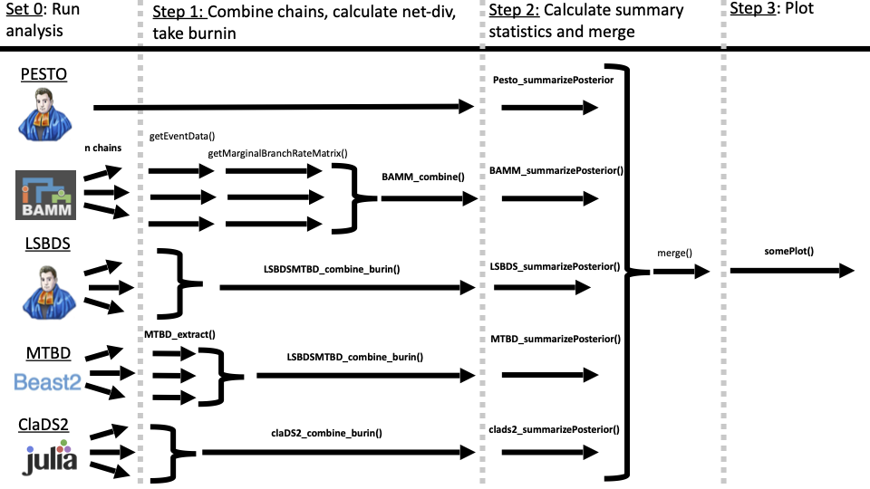

```{r setup, include=FALSE}
knitr::opts_chunk$set(echo=TRUE, warning = FALSE, message = FALSE)
knitr::opts_chunk$set(tidy.opts = list(width.cutoff = 50), tidy = TRUE)
```

```{r libraries}

# you'll need all the packages
library(BAMMtools)
library(ape)
library(treeio) # install from bioconductor if missing
library(ggtree) # install from bioconductor if missing
library(reshape2)
library(tidytree)
library(dplyr)
library(readr)
library(coda)
library(tibble) 
library(ggplot2)
library(cowplot) 

# source functions for this tutorial 
source("Scripts/compDivFunctions.R")
```

# Introduction

This tutorial will run you through helper functions for comparing the
outputs of BAMM, PESTO, LSBDS, MTBD and ClaDS2. This file is an
RMarkdown document. You can follow along in RStudio and run the "chunks"
of code at once or line by line. Alternatively, you can check out the
compiled version of this document as an HTML file and view the code and
figures. Open the HTML document in an internet browser like Chrome or
Firefox.

This tutorial will walk through processing and viewing the results of
some of the most commonly-used diversification rate inference methods.
The pipeline below visualizes the relationships between the functions
and the designed workflow:



The output of these analysis will vary slightly depending on the
platform you ran them on (eg., we ran BEAST on CIPRES and have CIPRES
output files) and the output name. We've provided output files for one
phylogeny from our analysis---A2017: Costaceae (André et. al 2016)---in
the "Input" folder. Here, you'll create a few output directories to
store the results of processing these files.

```{r setup directories}

dir.create("Output/") 
dir.create("Output/plots")
dir.create("Output/combined_posteriors") 

phylo_path <- "Input/costaceae_A2017.tre"
phylo <- read.tree(phylo_path)

```

# 1. Combine chains, calculate net-diversification and take burnin.

The first step is to read in the MCMC chains, calculate
net-diversification (see paper), remove burn-in and combine into a
single MCMC trace The following code chunks will do using various helper
functions.

## ClaDS2

We ran ClaDS2 using Julia but processed and saved the output as an
.RData object using the save_ClaDS_in_R() function. The code below reads
in that .RData object, removes burnin, and saves the data in a .csv
file.

```{r CLaDS2_mcmc}
claDS2_combined <- claDS2_combine_burin("input/ClaDS2/", burnin =.25)

write.csv(as.matrix(claDS2_combined), 
          file = paste0(paste0("Output/combined_posteriors/clads2_combinedPosterior.csv")))
```

## LSBDS

RevBayes will produce a variety of output depending on the Rev script.
The MCMC samples of lambda and mu values are located in a .log file that
are typically the output of mnStochasticBranchRate() function. The
following script will read in a directory with those logs to process.

```{r LSBDS_mcmc }

LSBDS_combined <- LSBDSMTBD_combine_burin(mcmc_chain_directory = "Input/LSBDS/",
                                          burnin=.05,
                                          MTBDorLSBDS = "LSBDS")
write.csv(LSBDS_combined,
          file = "Output/combined_posteriors/LSBDS_combinedPosterior.csv",
          row.names = F) 
```

## MTBD

BEAST writes out MCMC samples from the posterior of lambda and mu in an
annotated Nexus files; each MCMC samples contains the entire phylogeny.
This is slightly inconvenient for our purpose because the phylogeny is
fixed. The following code reads has two steps

1.  The first uses MTBD_extract() to read in each tree from a BEAST
    trace, one at a time and extract rate estimates. The workhorse of
    the MTBD_extract() function is a modified read.beast() function from
    treeio named .parseTreeString(). It was written with the help Mike
    May. This writes a (2\*(n+m)) by (y+1) matrix: where n and m are the
    number of tips and nodes in the phylogeny respectively, multiplied
    by two for both lambda and mu estimates. The number of MCMC samples
    with the first row corresponds to the node orders. This output will
    be similar to the LSBDS output.
2.  Combine chains using the LSBDSMTBD_combine_burnin() function as
    above.

Step 1. might take a little bit of time depending on the size of the
phylogeny. It should print a progress report every 10% of trees for a
given MCMC trace.

```{r MTBD_extractPosteriors}

# I've encountered an error that reuqires you to increase the sys.setenv size. This is part of read_lines.

Sys.setenv(VROOM_CONNECTION_SIZE = 100000000)

# create directory for extracted posteriors
dir.create("Input/MTBD/posteriorsExtracted")


# Step 1. Run MTBD_extract() in a loop over individual BEAST MCMC chains
files <- list.files("Input/MTBD")
file_beast_trees <- grep(x=files,
                         pattern = ".*\\.trees$",
                         value = T)
count = 0 
for(Beast_tree in file_beast_trees){
  count = count + 1
  
  posteriorOutput <- paste0("Input/MTBD/posteriorsExtracted/",Beast_tree,"_rates_chain", count,".csv")
  
  if( file.exists(posteriorOutput) == F ){
  MTBD <- MTBD_extract(paste0("Input/MTBD/",Beast_tree))
  write.csv(x=MTBD, file = paste0(posteriorOutput))
  
  } else(
    print(paste0(posteriorOutput, " has already been generated"))
  )
}


# Step 2. 
MTBD_combine_burnin <- LSBDSMTBD_combine_burin(mcmc_chain_directory= "Input/MTBD/posteriorsExtracted",
                                              burnin =.25,
                                              MTBDorLSBDS = "MTBD")
write.csv(as.matrix(MTBD_combine_burnin), 
              file = "Output/combined_posteriors/MTBD_combinedPosterior.csv",
              row.names = F)
```

## BAMM

The R package BAMMTools is a series of functions that help in processing
the BAMM output. We will use their getEventData() and
getMarginalBranchRateMatrix() functions to extract the lambda and mu
estimates.

BAMM_combine() will take burnin and calculate net-div.

```{r BAMM_mcmc}

BAMM_directory <- "Input/BAMM"
dir.create(paste0(BAMM_directory,"/posteriorsExtracted"))

eventData_output_file_path <- list.files(BAMM_directory,full.names = T) %>%
  grep(x = ., pattern = "event_data",value = T) 

edata <- getEventData(phylo, 
                      eventData_output_file_path, 
                      burnin=.1)
marg <- getMarginalBranchRateMatrix(edata)
write.csv(marg, paste0(BAMM_directory,"/posteriorsExtracted/BAMMrates.csv"))


BAMM_combine_burnin <- BAMM_combine(paste0(BAMM_directory,"/posteriorsExtracted/"))

write.csv(BAMM_combine_burnin,
          "Output/combined_posteriors/BAMM_combinedPosterior.csv",
          row.names = F) 
```

# 2 - Calculate Summary Statistics and Organize nodes

Here we calculate a set of summary statistics from the posteriors (see
below) and index all the nodes values so they match. The latter is need
as each method. LSBD, MSBD, save the root edge values. LSBD infers a
value of 0 while MSBD and CLaDS2 infer some value. BAMM and ClaDS2 do
not record this values (maybe it's zero?). Given this variation we
exclude this edge from the analysis. Finding the edge number can be
tricky. As I understand this edge number is sometime recorded in the
"phylo" object only if it has a length (as root.edge), however I cannot
confirm this. In at least one phylo, (e.g, A2016), the phylo\$root.edge
is not present. However, it seems the root edge value is always missing
from phylos\$edge[,2] sequence.

Summary Statistics 1. MAP 2. Posterior Median 3. Posterior Mean 4.
Quantile Intervals - using the quantile() 5. HPD Intervals

```{r SummarizePosterior}

LSBDS_combinedPosterior <- LSBDS_summarizePosterior(LSBDS_posterior_path=paste0("Output/combined_posteriors/LSBDS_combinedPosterior.csv"), Phylogeny_path = phylo_path)
bamm_combinedPosterior <- BAMM_summarizePosterior(bamm_posterior_path=paste0("Output/combined_posteriors/BAMM_combinedPosterior.csv"), Phylogeny_path = phylo_path)
MTBD_combinedPosterior <- MTBD_summarizePosterior(MTBD_posterior_path=paste0("Output/combined_posteriors/MTBD_combinedPosterior.csv"), Phylogeny_path = phylo_path)
clads2_combinedPosterior<- clads2_summarizePosterior(clads2_posterior_path=paste0("Output/combined_posteriors/clads2_combinedPosterior.csv"), Phylogeny_path = phylo_path)

pesto_path <- list.files("Input/PESTO",full.names = T) %>%
    grep(x = ., pattern = ".tsv", value = T)
Pesto_summarized <- Pesto_summarizePosterior(pesto_path = pesto_path,
                                             Phylogeny_path = phylo_path)

# Merge all summaries into a single data frame
combinedPosteriors <- merge(LSBDS_combinedPosterior,bamm_combinedPosterior, by = "Index") %>%
  merge(MTBD_combinedPosterior, by = "Index") %>%
  merge(clads2_combinedPosterior, by = "Index") %>%
  merge(Pesto_summarized, by = "Index")

# Specify if branches are nodes or tips
combinedPosteriors$TipOrNode <- ifelse(combinedPosteriors$Index <= length(phylo$tip.label), "Tip", "Node")

write.csv(combinedPosteriors,
          paste0("Output/combined_posteriors/combinedPosterior.csv"),
          row.names=F)
```

# 3. Plot Phylogeny

## a. comp_branch_plots

This function is meant to fit into the above pipeline. This function
will take in merged summary statistics and generate plot of painted
trees. It has two main arguments:\
1) It can paint any of summary statistics calculated above (i.e.,
posterior mean, posterior median, MAP). 2) It

```{r}
combined <- read.csv(paste0("Output/combined_posteriors/combinedPosterior.csv"),
                     header = TRUE) 

AllMethods <- comp_branch_plots(summaryStatisticsData = combined,
                          parameter = "median",
                          Branch_index = combined$Index,
                          phylo_path = phylo_path,
                          print_scale = F)

AllMethods_scaled <- comp_branch_plots(summaryStatisticsData = combined,
                          parameter = "median",
                          Branch_index = combined$Index,
                          phylo_path = phylo_path,
                          print_scale = T)
AllMethods
AllMethods_scaled

# save to file 
pdf(paste0("Output/plots/paintedTrees_allmethods.pdf"))
print(AllMethods)
print(AllMethods_scaled)
dev.off()
```

Users can subset there merged file to only plot some methods. For
example here we subset our data to only plots LSBDS, PESTO and MTBD

```{r}
combined <- read.csv(paste0("Output/combined_posteriors/combinedPosterior.csv"),
                     header = TRUE) 

# Subset by combined by all the 
combined_MTBD <- combined[,grep(x = colnames(combined),pattern = "MTBD")]
combined_LSBDS <- combined[,grep(x = colnames(combined),pattern = "LSBDS")]
combined_PESTO <- combined[,grep(x = colnames(combined),pattern = "PESTO")]

# Merge them all 
combined_LSBDSPESTOMTBD <- cbind(combined_LSBDS,combined_PESTO,combined_MTBD)

LSBDSPESTOMTBD_paintedTrees <- comp_branch_plots(summaryStatisticsData = combined_LSBDSPESTOMTBD,
                          parameter = "median",
                          Branch_index = combined$Index,
                          phylo_path = phylo_path,
                          print_scale = F)

LSBDSPESTOMTBD_paintedTrees_scaled <- comp_branch_plots(summaryStatisticsData = combined_LSBDSPESTOMTBD,
                          parameter = "median",
                          Branch_index = combined$Index,
                          phylo_path = phylo_path,
                          print_scale = T)

LSBDSPESTOMTBD_paintedTrees
LSBDSPESTOMTBD_paintedTrees_scaled

# save to file
pdf(paste0("Output/plots/paintedTrees_LSBDSPESTOMTBD.pdf"))
print(LSBDSPESTOMTBD_paintedTrees)
print(LSBDSPESTOMTBD_paintedTrees_scaled)
dev.off()
```

## plot_rate_phylo() and plot_rate_phylo_scaled()

If user want more freedom they can take advantage of plot_rate_phylo()
and plot_rate_phylo_scaled(). These are the two plotting functions
underlying comp_branch_plots(). plot_rate_phylo() simply takes in a
object class "tidytree" with relevant information as such,

```{r}
# Read in data
combined <- read.csv(paste0("Output/combined_posteriors/combinedPosterior.csv"),
                     header = TRUE) 

phylo_tib <- read.tree(phylo_path) %>%
    as.tibble(phylo)

# Data Wrangle
combined_Plot <- data.frame(combined$ClaDS2_median_lambda,
                            combined$Index)
names(combined_Plot) <- c("value","node") 
phylo_tib_data <- dplyr::full_join(phylo_tib, combined_Plot, by = 'node') %>% 
  treeio::as.treedata()

# Plot and Export
p <- plot_rate_phylo(phylo_tib_data);p


# save to file
pdf(paste0("Output/plots/ClaDS2_rate_plot.pdf"))
print(p)
dev.off()
```

Using plot_rate_phylo_scaled() only makes sense if you are plotting two
methods together, as scale function is applied to the dataset.
plot_rate_phylo_scaled() requires an additional set of arguments
"gradient_max" and "gradient_min" to determine how to scale the
phylogeny

```{r}
# Read in data
combined <- read.csv(paste0("Output/combined_posteriors/combinedPosterior.csv"),
                     header = TRUE) 

phylo_tib <- read.tree(phylo_path) %>%
    as.tibble(phylo)

# Scale BAMM and PESTO extinction
combined_scale <- data.frame(combined$PESTO_mu,combined$BAMM_median_mu) %>%
  scale() %>%
  as.data.frame()

# Identify min and Max values
combined_scale_melt <- reshape2::melt(combined_scale)
scale_max <- max(combined_scale)
scale_min <- min(combined_scale)

# Plot PESTO
combined_scale_PESTO <- data.frame(combined_scale$combined.PESTO_mu,
                                   combined$Index)
names(combined_scale_PESTO) <- c("value","node") 
phylo_tib_data <- dplyr::full_join(phylo_tib, combined_scale_PESTO, by = 'node')%>% 
  treeio::as.treedata()
PESTOscaled <- plot_rate_phylo_scaled(phylo_tib_data,
                                  gradient_max = scale_max,
                                  gradient_min = scale_min)

# Plot BAMM
combined_scale_BAMM <- data.frame(combined_scale$combined.BAMM_median_mu,
                                   combined$Index)
names(combined_scale_BAMM) <- c("value","node") 
phylo_tib_data <- dplyr::full_join(phylo_tib, combined_scale_BAMM, by = 'node')%>% 
  treeio::as.treedata()
BAMMscaled <- plot_rate_phylo_scaled(phylo_tib_data,
                                  gradient_max = scale_max,
                                  gradient_min = scale_min)

# Combine into a single plot with cowplot package
legend_scaled <- cowplot::get_legend( PESTOscaled )
scaled_plot <- cowplot::plot_grid(PESTOscaled + theme(legend.position="none"),
                                  BAMMscaled + theme(legend.position="none"),
                                  legend_scaled,
                                  rel_widths = c(1,1,.2),
                                  nrow = 1)
scaled_plot

# save to file 
pdf(paste0("Output/plots/scaled_rate_plot.pdf"))
scaled_plot
dev.off()
```
